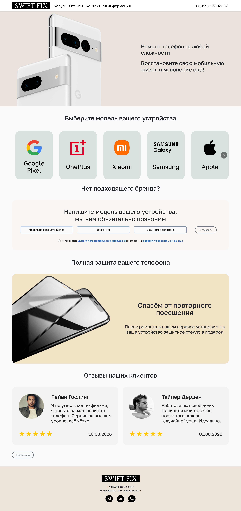
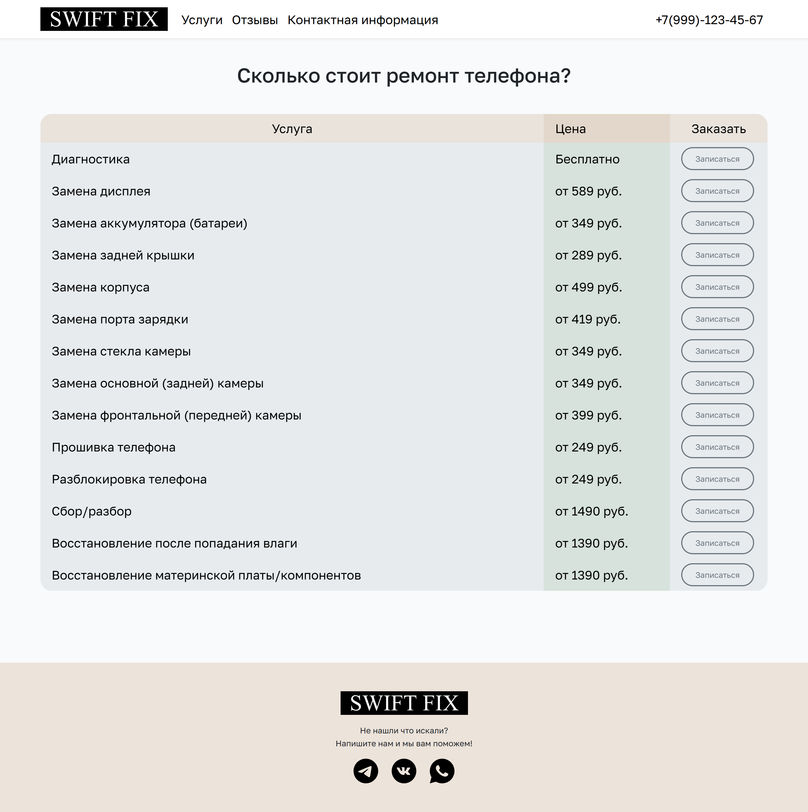
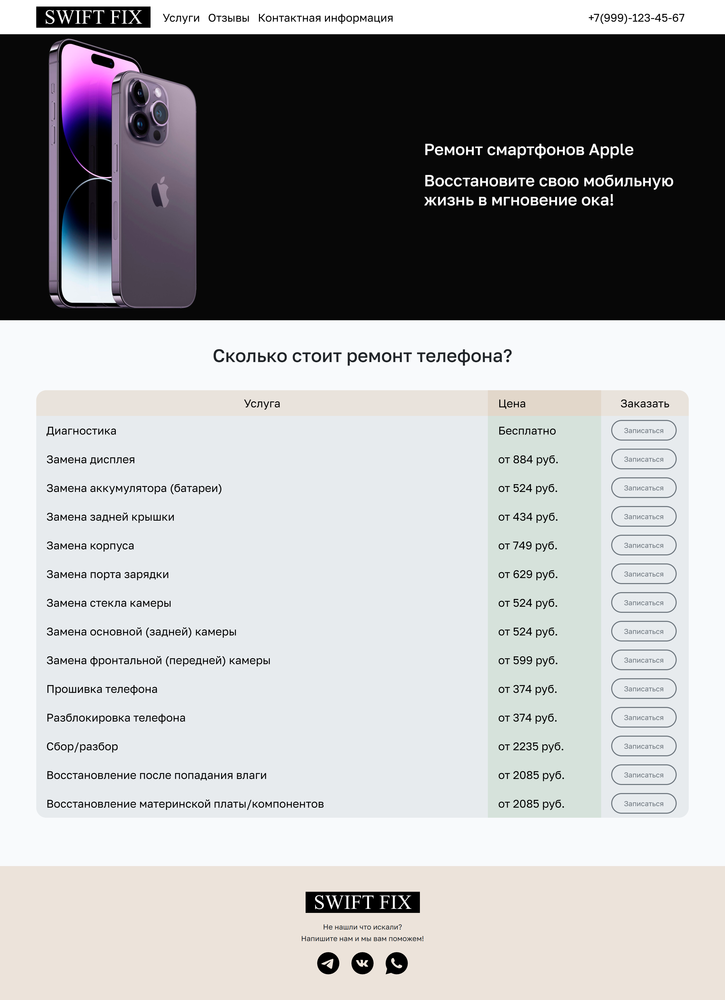
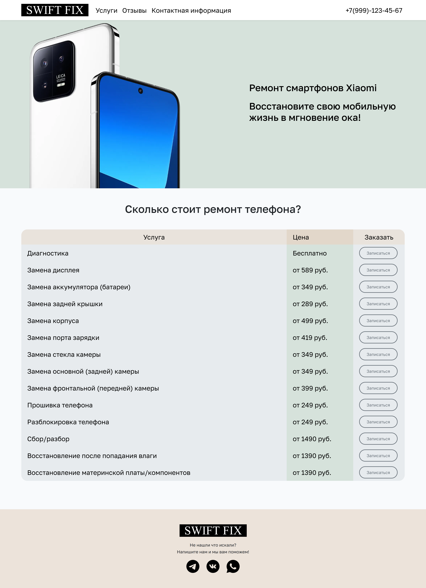
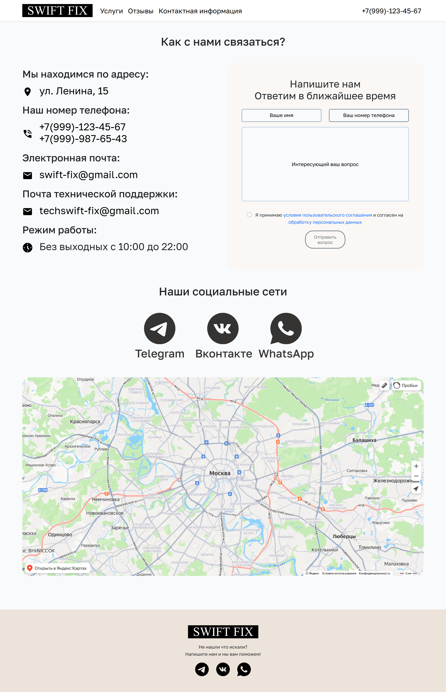
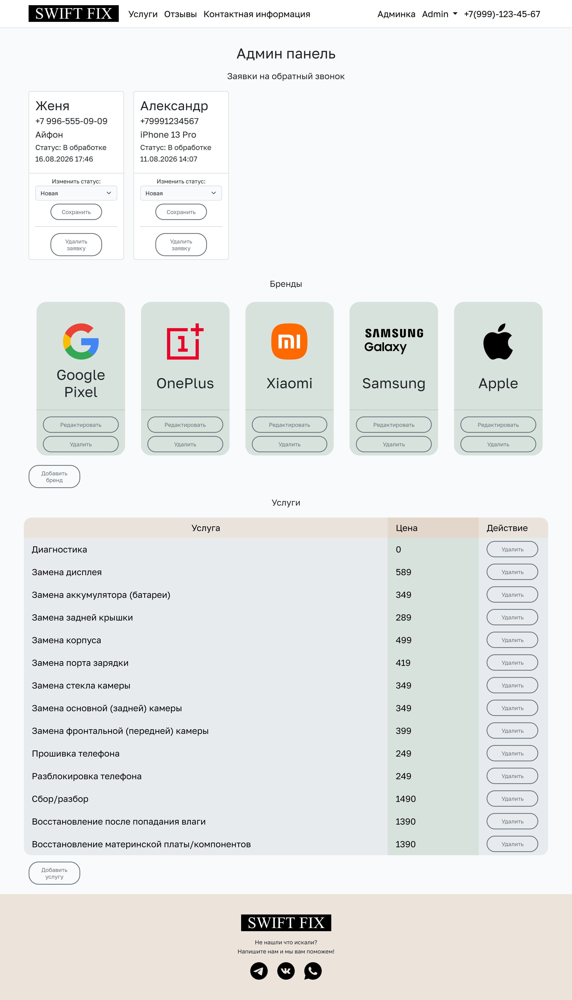
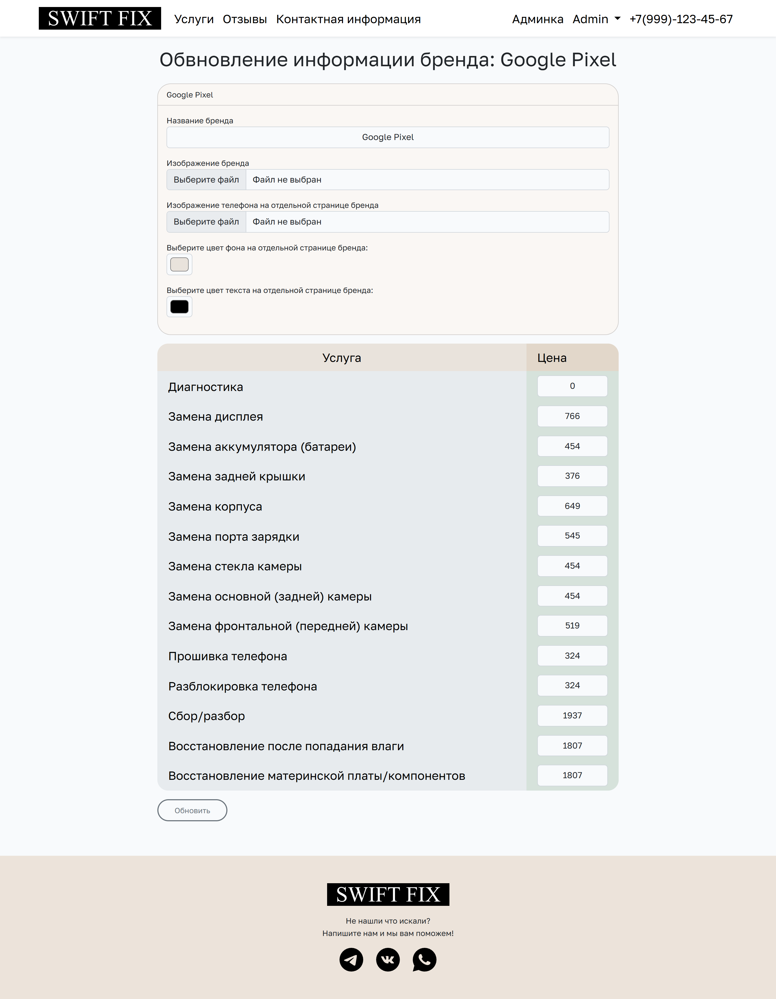

# 📱 SwiftFix — Портал по ремонту телефонов

<p align="center">
  <b>🇷🇺 Русская версия</b> | <a href="README.md">🇺🇸 English Version</a>
</p>

[](https://laravel.com)
[](https://vuejs.org)
[](https://vitejs.dev)
[](https://getbootstrap.com)

**SwiftFix** — это full-stack веб-приложение для сервисного центра по ремонту телефонов, разработанное на базе **Laravel 10**. Проект предоставляет удобный интерфейс для просмотра услуг ремонта, поддерживаемых брендов телефонов, чтения отзывов и отправки заявок на обратный звонок, а также полноценную панель администратора.

> **О проекте:** Этот репозиторий представляет собой один из моих коммерческих full-stack проектов, разработанный как MVP (минимально жизнеспособный продукт) для реального сервисного центра. Это не просто Landing Page, а полноценная CRM/CMS система с базой данных и ролевой моделью.

---

## ✨ Возможности и Интерфейс

### 🧑‍💻 Клиентская часть (Frontend)

Пользовательский интерфейс адаптирован под мобильные устройства и предлагает удобную навигацию по услугам и брендам. Динамическое ценообразование позволяет скрывать цены (выводя "Бесплатно") для определенных услуг.

<details>
  <summary><b>👀 Посмотреть дизайн главной страницы целиком (Кликните)</b></summary>
  <br>
  
</details>

<br>

| Прайс-лист всех услуг | Услуги конкретного бренда (Apple) |
| :---: | :---: |
|  |  |
| *Динамический прайс-лист с умным форматированием (от N руб / Бесплатно)* | *Фильтрация услуг по конкретному бренду* |

| Услуги конкретного бренда (Xiaomi) | Страница Контактов |
| :---: | :---: |
|  |  |
| *Автоматическая подвязка логотипов и цен* | *Интеграция с Яндекс.Картами и контактными данными* |

### 🛡️ Панель управления (Админка)

Защищенная зона для управления контентом сайта. Администратор может обрабатывать входящие заявки, а также добавлять, удалять и редактировать бренды и услуги.

| Дашборд и Заявки | Редактирование Бренда |
| :---: | :---: |
|  |  |
| *CRM-модуль: просмотр и удаление заявок клиентов* | *CRUD-операции: изменение брендов и загрузка картинок* |

---

## 🛠 Стек технологий

- **Backend:** [Laravel 10](https://laravel.com/) (PHP 8.1+)
- **Frontend:** HTML5, CSS3, JS с использованием сборщика [Vite](https://vitejs.dev/)
- **Стилизация:** [Bootstrap 5](https://getbootstrap.com/) и препроцессор SCSS, анимации на AOS.js
- **База данных:** SQLite / MySQL (через Eloquent ORM)
- **Дополнительно:** Axios, jQuery, Intervention Image

---

## ⚙️ Установка и запуск

### Требования

- Node.js и npm
- PHP `>= 8.1`
- Composer

### Инструкция

1. **Клонируйте репозиторий:**
   ```bash
   git clone https://github.com/KbrYbk/SwiftFix.git
   cd SwiftFix
   ```

2. **Установите PHP зависимости:**
   ```bash
   composer install
   ```

3. **Установите Node зависимости:**
   ```bash
   npm install
   ```

4. **Настройте переменные окружения:**
   Создайте файл `.env` на основе примера и сгенерируйте ключ:
   ```bash
   cp .env.example .env
   php artisan key:generate
   ```
   *База данных по умолчанию настроена на использование SQLite.*

5. **Запустите миграции и сидеры:**
   ```bash
   php artisan migrate --seed
   ```

6. **Запустите сервер:**
   ```bash
   php -S 127.0.0.1:8000 -t public
   ```
   Сайт будет доступен по адресу `http://localhost:8000`.

   **Доступ в админ-панель:** 
   Логин: `admin`
   Пароль: `admin`

---

## 📂 Архитектура проекта

```text
SwiftFix/
├── app/
│   ├── Http/Controllers/   # Логика (Admin, Brand, Service, Review)
│   └── Models/             # Eloquent модели
├── database/
│   └── migrations/         # Структура базы данных
├── public/                 # Публичные файлы (картинки, загрузки)
├── resources/
│   ├── js/                 # Фронтенд логика
│   ├── sass/               # SCSS стили
│   └── views/              # Blade шаблоны (структура UI)
└── routes/
    └── web.php             # Маршрутизация приложения
```
